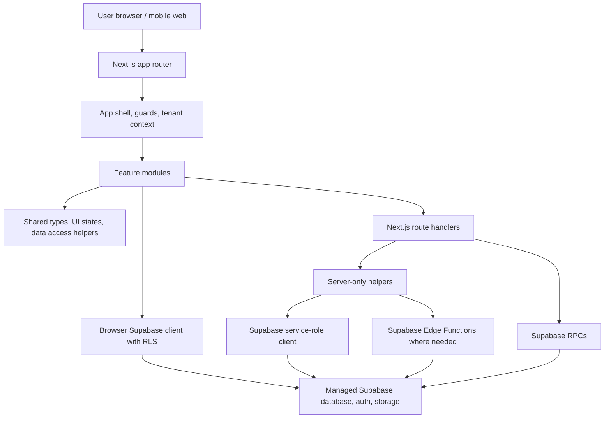
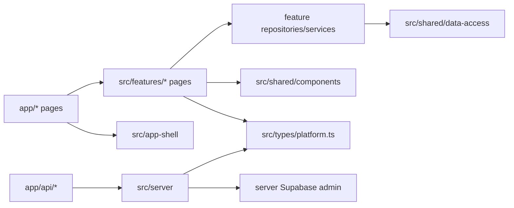

# Platform Architecture Baseline

Last updated: 2026-05-27

This is the frozen Phase 02 architecture target for the next execution cycle. It describes how FlowForce should be built until a later roadmap phase deliberately changes the platform shape.

## Build Direction

FlowForce remains a single Next.js application for web and mobile web/PWA.

`.tsx` files are React components written in TypeScript. They are normal for a Next.js web app and do not mean the project is already a native mobile app. A future mobile app can still reuse React/TypeScript concepts if we choose Capacitor or React Native/Expo, but the current runtime is Next.js.

Accepted near-term path:

- Web app: Next.js App Router.
- Mobile now: responsive PWA/mobile web inside the same Next.js app.
- Native wrapper later: Capacitor-first after pilot workflows are stable on mobile web.
- Native rewrite later: Expo/React Native or Flutter only if the wrapper path fails pilot-critical needs.

## Runtime Diagram



## Source Tree Target

```text
app/
  api/                    Next route handlers for server-only app operations
  app/                    Authenticated application routes
  auth/                   Authentication route wrapper
  company-registration/   Public company setup entry
  onboarding/             Public onboarding route
  pricing/, features/     Marketing/product routes

src/
  app-shell/              Authenticated shell, guards, navigation, tenant setup
  features/               Product modules and feature-owned UI
  shared/                 Cross-feature UI states, utilities, data-access helpers
  types/                  Cross-module platform contracts and generated type helpers
  server/                 Server-only domain helpers and automation logic
  integrations/           Supabase and external provider clients
  lib/                    Runtime config, permissions, API gateways, app utilities
  hooks/                  Existing global hooks to migrate gradually
  repositories/           Existing root repositories to migrate gradually
  services/               Existing shared services to migrate gradually

supabase/
  migrations/             Schema and policy migrations
  tests/                  SQL security and contract tests
  functions/              Edge functions for AI, learning, vendor, and schedule work
  database.types.ts       Generated schema types

docs/
  roadmap/                Execution plans and phase reports
  *.md                    Architecture, environment, testing, and launch docs
```

## Boundary Diagram



## Accepted Conventions

- Keep one Next.js app and npm package until extraction rules are met.
- Use `package-lock.json` and `npm ci` in CI.
- Keep App Router route files thin; feature modules own most UI and feature-specific state.
- Use `src/app-shell` for authenticated shell, navigation, guards, tenant setup, and shared route behavior.
- Use `src/features` for product modules.
- Use `src/shared` only for cross-feature primitives, shared UI states, utilities, and data-access helpers.
- Use `src/types/platform.ts` for tenant, profile, permission, module, API result, and Supabase generated-type helpers.
- Use `src/server` and `app/api/*` for server-only and sensitive operations.
- Keep service-role Supabase usage out of browser/client surfaces.
- Use Next route handlers for v1 sensitive app APIs.
- Use Supabase RLS/RPCs for tenant-safe database workflows.
- Use Supabase Edge Functions for AI/copilot/vendor/schedule work only after auth, tenant scope, audit, and idempotency are explicit.
- Keep managed Supabase for v1; local Supabase remains the CI/security-test runtime.
- New cross-boundary imports should prefer `@app-shell/*`, `@features/*`, `@shared/*`, and `@server/*`.
- Existing `@/*` imports can remain until touched naturally.

## Check Tiers

Fast local architecture check:

```bash
npm run check:local
```

Full local release check:

```bash
npm run check:release
```

Remote deploy check:

```bash
npm run check:deploy
```

GitHub Release Gates remain the full shipment gate. GitHub Deploy Readiness remains the remote Supabase readiness gate.

## Deferred Work

Deferred until later roadmap phases:

- pnpm migration.
- Turbo monorepo.
- `packages/shared` or `packages/core`.
- Separate backend service.
- Self-hosted Supabase.
- Deep offline-first architecture.
- Capacitor native shell implementation.
- Expo/React Native rewrite.
- Flutter rewrite.

Extraction may start only after the source boundary has a stable public barrel, aliases are already used, client/server leakage checks pass, and `npm run check:release` remains green.

## Next Roadmap Handoff

Phase 03 should build on this architecture by hardening SaaS foundations:

- Tenant model.
- Onboarding reliability.
- Roles and permissions.
- Company settings.
- Audit logs.
- Billing readiness.
- Data lifecycle.
- Support/admin tooling.
- Security review.

The next active phase is `03.01 Tenant Model Confirmation`.
