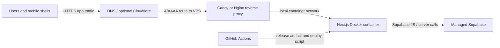

# Production Runtime Decision

Date: 2026-05-30
Roadmap phase: 10.01 Production Runtime Decision

## Decision

FlowForce production runtime is VPS-first.

- Hosting target: Contabo VPS.
- App runtime: Dockerized Next.js production server.
- Database/auth/storage target: managed Supabase.
- Reverse proxy target: Caddy or Nginx in front of the web container.
- Domain target: production domain DNS points to the VPS public IP.
- SSL target: reverse proxy terminates TLS and renews certificates automatically.
- CDN target: Cloudflare is optional; start DNS-only or proxied after TLS/proxy validation.
- Backup target: managed Supabase backups plus release-time exports, VPS snapshots, and encrypted offsite artifacts.

This plan does not depend on Vercel.

## Runtime Diagram

## Supabase Decision

Production keeps Supabase managed for:

- Postgres.
- Auth.
- Storage.
- RLS enforcement.
- Migration history.
- Remote deploy drift checks.
- Managed backup baseline.

Self-hosting Supabase on the VPS is intentionally deferred. It would add operational risk before paid pilot launch.

## Domain, SSL, CDN

The domain is not chosen yet, but the production shape is not ambiguous:

1. Buy or choose the production domain.
2. Point DNS A/AAAA records to the Contabo VPS public IP.
3. Run Caddy or Nginx on the VPS.
4. Redirect HTTP to HTTPS.
5. Terminate TLS at the reverse proxy.
6. Add security headers and compression in Phase 10.03.
7. Enable Cloudflare proxy/CDN only after staging validates SSL, auth redirects, file upload, and mobile shell behavior.

## Backup Approach

Backups have four layers:

- Managed Supabase point-in-time/daily backups according to the Supabase project plan.
- Pre-release `pg_dump` or Supabase export before risky migrations.
- Contabo VPS volume snapshots before OS/runtime changes.
- Encrypted offsite artifacts for release exports and restore drills.

Phase 10.05 will turn this into scripts, schedule, retention, and restore-drill evidence.

## Deferred Decisions

- Final production domain name.
- Caddy versus Nginx implementation.
- Cloudflare DNS-only versus proxied mode.
- Exact Contabo VPS size after Docker baseline and load baseline.

## Verification

10.01 is complete when:

- `npm run check:production-runtime` passes.
- Contabo VPS is documented as the hosting target.
- Managed Supabase is documented as the production database/auth/storage target.
- Domain, SSL, CDN, and backup approach are documented.
- Runtime diagram exists.
- The roadmap points to Docker Baseline as the next phase.
